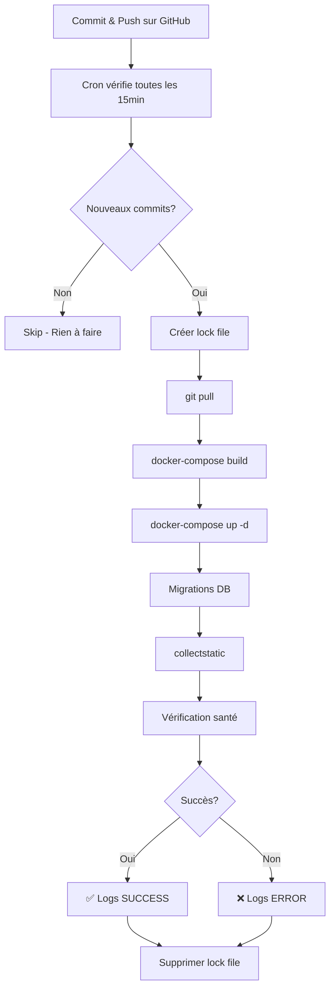

# 🤖 Configuration du Déploiement Automatique avec Cron

Ce guide explique comment configurer un déploiement automatique de **Coucou Beauté** qui se déclenche automatiquement lorsque de nouveaux commits sont poussés sur GitHub.

---

## 📋 Vue d'ensemble

Le script `deploy-cron.sh` :
- 🔍 Vérifie toutes les 15 minutes s'il y a de nouveaux commits sur GitHub
- 🚀 Lance automatiquement `deploy.sh` si de nouveaux commits sont détectés
- 📝 Enregistre tous les logs dans `/var/log/coucou_deploy_cron.log`
- 🔒 Empêche les déploiements simultanés (lock file)
- ✅ Fonctionne en arrière-plan sans intervention manuelle

---

## 🚀 Installation

### Étape 1: Copier le script sur le serveur

Le script `deploy-cron.sh` doit être présent dans `/opt/coucou_beaute/`:

```bash
cd /opt/coucou_beaute
ls -la deploy-cron.sh
```

Si le script n'existe pas, il sera créé lors du prochain `git pull`.

### Étape 2: Rendre le script exécutable

```bash
sudo chmod +x /opt/coucou_beaute/deploy-cron.sh
```

### Étape 3: Créer le fichier de log

```bash
sudo touch /var/log/coucou_deploy_cron.log
sudo chown vpsuser:vpsuser /var/log/coucou_deploy_cron.log
```

### Étape 4: Configurer Cron

#### Option A: Édition manuelle de crontab

```bash
crontab -e
```

Ajouter cette ligne (déploiement toutes les 15 minutes):

```cron
*/15 * * * * /opt/coucou_beaute/deploy-cron.sh >> /var/log/coucou_deploy_cron.log 2>&1
```

#### Option B: Script d'installation automatique

Créer et exécuter ce script:

```bash
cat > /tmp/setup-cron.sh << 'EOF'
#!/bin/bash

CRON_JOB="*/15 * * * * /opt/coucou_beaute/deploy-cron.sh >> /var/log/coucou_deploy_cron.log 2>&1"

# Vérifier si la tâche existe déjà
if crontab -l 2>/dev/null | grep -q "deploy-cron.sh"; then
    echo "✅ Tâche cron déjà configurée"
else
    # Ajouter la tâche cron
    (crontab -l 2>/dev/null; echo "$CRON_JOB") | crontab -
    echo "✅ Tâche cron ajoutée avec succès!"
fi

# Vérifier la configuration
echo ""
echo "📋 Configuration cron actuelle:"
crontab -l | grep deploy-cron
EOF

chmod +x /tmp/setup-cron.sh
bash /tmp/setup-cron.sh
```

---

## ⚙️ Configuration

### Fréquences de Déploiement

Modifier la fréquence en changeant la partie `*/15` dans la ligne cron:

| Fréquence | Expression Cron | Description |
|-----------|----------------|-------------|
| Toutes les 5 min | `*/5 * * * *` | Très réactif (recommandé développement) |
| Toutes les 15 min | `*/15 * * * *` | Équilibré (recommandé production) |
| Toutes les 30 min | `*/30 * * * *` | Moins fréquent |
| Toutes les heures | `0 * * * *` | Peu fréquent |
| Chaque jour à 3h | `0 3 * * *` | Maintenance nocturne |

### Personnalisation du Script

Éditer `/opt/coucou_beaute/deploy-cron.sh`:

```bash
# Changer le répertoire du projet
PROJECT_DIR="/opt/coucou_beaute"

# Changer le fichier de log
LOG_FILE="/var/log/coucou_deploy_cron.log"

# Changer la branche surveillée
BRANCH="main"
```

---

## 📊 Surveillance & Logs

### Voir les logs en temps réel

```bash
tail -f /var/log/coucou_deploy_cron.log
```

### Voir les derniers déploiements

```bash
tail -n 100 /var/log/coucou_deploy_cron.log
```

### Rechercher les erreurs

```bash
grep "❌" /var/log/coucou_deploy_cron.log
```

### Voir les déploiements réussis

```bash
grep "✅ Déploiement automatique réussi" /var/log/coucou_deploy_cron.log
```

### Statistiques de déploiement

```bash
# Nombre total de déploiements
grep "Démarrage du déploiement automatique" /var/log/coucou_deploy_cron.log | wc -l

# Déploiements réussis
grep "Déploiement automatique réussi" /var/log/coucou_deploy_cron.log | wc -l

# Déploiements échoués
grep "Échec du déploiement automatique" /var/log/coucou_deploy_cron.log | wc -l
```

---

## 🧪 Test Manuel

### Tester le script sans cron

```bash
sudo bash /opt/coucou_beaute/deploy-cron.sh
```

### Simuler un nouveau commit

```bash
cd /opt/coucou_beaute
git fetch origin main
git log HEAD..origin/main
```

### Forcer un déploiement

Si vous voulez forcer un redéploiement même sans nouveaux commits:

```bash
sudo bash /opt/coucou_beaute/deploy.sh
```

---

## 🔧 Dépannage

### Le cron ne se lance pas

**Vérifier que cron est actif:**
```bash
sudo systemctl status cron
```

**Redémarrer cron:**
```bash
sudo systemctl restart cron
```

### Vérifier les tâches cron

```bash
crontab -l
```

### Permissions insuffisantes

```bash
sudo chmod +x /opt/coucou_beaute/deploy-cron.sh
sudo chown vpsuser:vpsuser /opt/coucou_beaute/deploy-cron.sh
```

### Lock file bloqué

Si le déploiement est bloqué:

```bash
sudo rm -f /tmp/coucou_deploy.lock
```

### Espace disque insuffisant

Vérifier l'espace disque:

```bash
df -h
```

Nettoyer les anciens logs:

```bash
sudo truncate -s 0 /var/log/coucou_deploy_cron.log
```

### Git fetch échoue

Vérifier la connexion GitHub:

```bash
cd /opt/coucou_beaute
git fetch origin main
```

Si erreur d'authentification:

```bash
# Vérifier les clés SSH
ssh -T git@github.com

# Ou utiliser HTTPS avec token
git remote set-url origin https://github.com/username/coucou_beaute.git
```

---

## 📧 Notifications (Optionnel)

### Ajouter des notifications par email

Installer `mailutils`:

```bash
sudo apt install mailutils
```

Modifier `deploy-cron.sh` pour ajouter:

```bash
# En cas de succès
echo "Déploiement réussi: ${REMOTE:0:7}" | mail -s "Coucou Beauté - Déploiement OK" admin@example.com

# En cas d'échec
echo "Déploiement échoué. Voir logs: $LOG_FILE" | mail -s "Coucou Beauté - ERREUR" admin@example.com
```

### Notifications Slack/Discord

Ajouter un webhook dans `deploy-cron.sh`:

```bash
# Slack
curl -X POST "https://hooks.slack.com/services/YOUR/WEBHOOK/URL" \
  -H "Content-Type: application/json" \
  -d '{"text":"✅ Coucou Beauté déployé: '"${REMOTE:0:7}"'"}'

# Discord
curl -X POST "https://discord.com/api/webhooks/YOUR/WEBHOOK/URL" \
  -H "Content-Type: application/json" \
  -d '{"content":"✅ Coucou Beauté déployé: '"${REMOTE:0:7}"'"}'
```

---

## 🎯 Workflow de Déploiement

### Flux Normal



### Exemple de Timeline

```
13:00 - Développeur push sur GitHub
13:15 - Cron détecte les changements
13:16 - Déploiement automatique démarre
13:19 - Base de données migrée
13:20 - Static files collectés
13:21 - Services redémarrés
13:22 - ✅ Déploiement terminé
13:22 - Site mis à jour accessible
```

---

## 📝 Checklist d'Installation

- [ ] Script `deploy-cron.sh` présent et exécutable
- [ ] Fichier de log créé avec bonnes permissions
- [ ] Tâche cron configurée (`crontab -l`)
- [ ] Cron service actif (`systemctl status cron`)
- [ ] Test manuel réussi (`bash deploy-cron.sh`)
- [ ] Logs visibles (`tail -f /var/log/coucou_deploy_cron.log`)
- [ ] Git fetch fonctionne (pas d'erreur d'auth)
- [ ] Docker accessible par l'utilisateur cron

---

## 🎉 Résumé

Avec cette configuration:

✅ **Déploiement 100% automatique**  
✅ **Surveillance continue** (toutes les 15 min)  
✅ **Logs détaillés** pour audit  
✅ **Protection contre déploiements simultanés**  
✅ **Aucune intervention manuelle nécessaire**  

**Workflow**: `git push` → *15 min* → **Site mis à jour automatiquement** 🚀

---

**Dernière mise à jour**: Octobre 2025  
**Maintenance**: Vérifier les logs régulièrement  
**Support**: Consulter `/var/log/coucou_deploy_cron.log` en cas de problème

